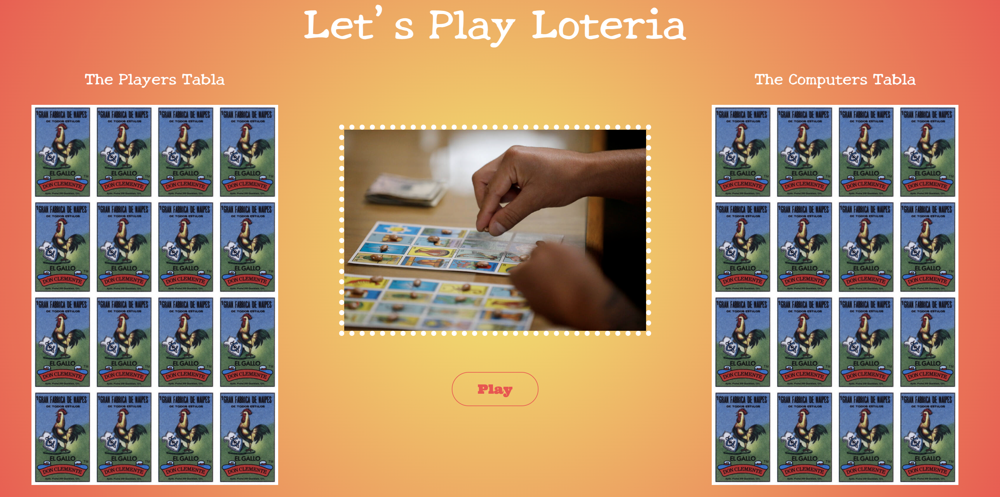
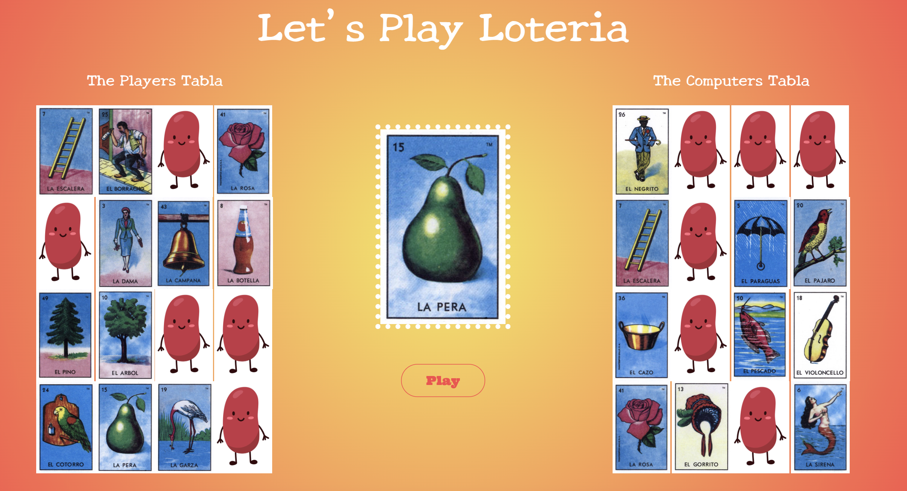

# loteria-game
A simplified version of the classic Mexican card game 'Loteria'. The game consists of players being provided a 4 by 4 'tabla' consisting of 16 randomly generated cards from the 54-card deck. As the game begins, every 5 seconds a new randomly generated card is shown in the middle. The player must then identify if that card is available on their tabla and select it. The player wins when they fill a 4-card-long column, row or diagonal. At the same time, they are playing against an AI computer opponent on the right.

# Game Previews, at start and during gameplay

# Technologies Used: 
Javascript, HTML5, CSS3, Giphy

# Getting Started: 
https://gcastrocastro.github.io/loteria-game/

Instructions: As the player, you will play on the tabla located on the left. When you press the play button, a new card will show every five seconds and you will have that time to identify if your tabla has it. If it does, click on it. You win once you get any 4-card long column, row, or diagonal.

# Next Steps:
- To add additional randomized gifs for the win/loss message
- Add a timer so the player can know how much time is left.
- To expand on the number of tablas that can be played at a time

